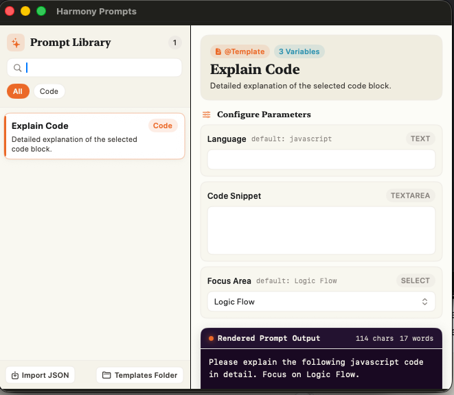
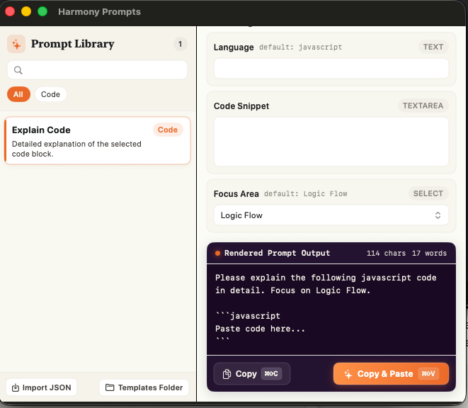

# Harmony Prompts — macOS

Quick-insert AI prompt templates via a menu bar app. Works in Cursor, browser, Terminal, anywhere.

See [`HarmonyPrompts/README.md`](HarmonyPrompts/README.md) for details.

## Screenshots

| Template Selection & Configuration | Real-Time Preview & Quick Paste |
| :---: | :---: |
|  |  |
| Browse and search prompt templates, then configure dynamic parameter fields (language, code snippet, focus area, etc.). | Live preview of rendered prompt with character/word count, supporting one-click copy (`⌘C`) and auto-paste (`⌘⌥V`). |

## Features

- **Menu Bar Quick Access**: Resides in the macOS menu bar for fast access across Cursor, VS Code, browsers, Terminal, or any other application.
- **Dynamic Prompt Templates**: Supports multi-variable parameter configurations and custom form controls (text input, multiline text, dropdown selection).
- **Live Preview & Statistics**: Real-time prompt output rendering with live character and word count tracking.
- **Instant Injection (Copy & Paste)**: One-click clipboard copy (`⌘C`) or direct auto-paste into active frontmost application (`⌘⌥V`).
- **Flexible Template Management**: Support importing templates via JSON or directly editing the local `templates.json` configuration.

## Installation

### One-line Install (Recommended)

Install and build Harmony Prompts directly to `/Applications` via curl:

```bash
curl -fsSL https://raw.githubusercontent.com/Poseidoncode/HarmonyApp/main/install.sh | bash
```

> **Requirement**: macOS 14.0+ with Xcode installed.

### Build from Source

```bash
git clone https://github.com/Poseidoncode/HarmonyApp.git
cd HarmonyApp
./install.sh
```

Or open `HarmonyPrompts/HarmonyPrompts.xcodeproj` in Xcode and press Run (`⌘R`).

<details>
<summary>Troubleshooting Xcode setup</summary>

If you encounter `xcodebuild` path or license errors, run:

```bash
sudo xcode-select -s /Applications/Xcode.app/Contents/Developer
sudo xcodebuild -license accept
xcodebuild -runFirstLaunch
```

</details>

## Quick Start

1. Launch **Harmony Prompts** from `/Applications` or Spotlight.
2. Click the menu bar bubble icon.
3. Pick a template, fill in parameters, and click **Copy** (`⌘C`) or **Copy & Paste** (`⌘⌥V`).

Run from **`/Applications/Harmony Prompts.app`** (not the `build/` folder) so Accessibility permission stays valid.

## Accessibility (Copy & Paste)

**Copy & Paste** requires **System Settings -> Privacy & Security -> Accessibility**.

Enable **Harmony Prompts** once. If you see duplicate entries, remove old ones pointing at `build/` paths.

Until permission is granted, use **Copy** + manual **⌘V**.

## Project Layout

```
HarmonyPrompts/
├── HarmonyPrompts/          # SwiftUI app source
├── HarmonyPrompts.xcodeproj
└── scripts/                 # Icon build scripts
```

## Security & Privacy

Harmony Prompts operates 100% locally with zero data collection, no telemetry, and no outbound network calls. All templates and prompt evaluations remain strictly on your local machine.

For security policies, vulnerability reporting, and threat model details, see [SECURITY.md](SECURITY.md).
